Documento de Arquitectura de Software (DAS)

**Proyecto**

AGROBODEGA

**Arquitectos**

Kelly Fernanda Uribe Giraldo

Daniel Henao Londoño

# Control de cambios y revisiones

|**Versión**|**Fecha**|**Tipo**|**Descripción**|**Autor**|
| - | - | - | - | - |
|**1**|16/04/2026|Creación|Versión inicial del documento|Kelly Uribe y Daniel Henao|
|**2**|||||
|**3**|||||

Contenido

[Control de cambios y revisiones	2](#_4meut5fih1rs)

[1.	(NO) Propósito del proyecto	14](#_67eqddeo1nke)

[2.	Motivadores de la arquitectura	14](#_7t7iquua2ad2)

[2.1	Restricciones técnicas	14](#_pzhu4aoofb9s)

[2.2	Restricciones de negocio	14](#_vlxrz3ajzcov)

[2.3	Atributos de calidad	14](#_kzc7dtyd0khw)

[2.3.1	Atributo calidad 1	14](#_pdi1yehgimwp)

[2.3.1.1	Característica 1	14](#_8yozci8gzgxx)

[2.3.1.1.1	Escenario de calidad 1	14](#_ubk3jyzf26zu)

[2.3.1.1.2	Escenario de calidad 2	14](#_28ylifrbccu0)

[2.3.1.1.3	Escenario de calidad 3	14](#_4i42k9gwxwjk)

[2.3.1.1.N Escenario de calidad N	14](#_fofglscc0ndd)

[2.3.1.2	Característica 2	15](#_yo5fczb1m4z3)

[2.3.1.2.1	Escenario de calidad 1	15](#_qibuwrb1t1ij)

[2.3.1.2.2	Escenario de calidad 2	15](#_fp5ykpbsvhh8)

[2.3.1.2.3	Escenario de calidad 3	15](#_t7zfzcxhc5hf)

[2.3.1.2.N Escenario de calidad N	15](#_ipo88tp9jjn)

[2.3.2	Atributo calidad 2	15](#_in6srat0vu82)

[2.3.2.1	Característica 1	15](#_vd74821gdpmm)

[2.3.2.1.1	Escenario de calidad 1	15](#_l5jfelr9r6d5)

[2.3.2.1.2	Escenario de calidad 2	15](#_knbxj3vhxf8e)

[2.3.2.1.3	Escenario de calidad 3	15](#_43hg69lr1gmw)

[2.3.2.1.N Escenario de calidad N	15](#_th2pmtovy7eg)

[2.3.2.2	Característica 2	15](#_czz1vsvusl2r)

[2.3.2.2.1	Escenario de calidad 1	16](#_w8d4vh568jo9)

[2.3.2.2.2	Escenario de calidad 2	16](#_cqcyliwqb1mi)

[2.3.2.2.3	Escenario de calidad 3	16](#_8n2wd3kh9kqp)

[2.3.2.1.N Escenario de calidad N	16](#_ggf7j53cct5u)

[2.4	Funcionalidades críticas	16](#_ivledouui3d5)

[3.	Tácticas y estrategias	16](#_jmz933lyigcq)

[4.	Modelo de contexto	16](#_8p7avfoc8c3)

[5.	Arquetipo de solución/referencia	16](#_sxf0d8mvwh7x)

[6.	Arquitectura de solución/referencia	16](#_ieupqjn4t6b7)

[7.	Línea base arquitectónica	16](#_wvpf9bcm28i7)

[7.1	Línea base arquitectónica de componentes	17](#_ty1pl3m9z46v)

[7.1.1	Componente 1	17](#_l95z1tjmkjri)

[7.1.2	Componente 1	17](#_qr5mpmqncw4l)

[7.2	Estilos y patrones arquitectónicos adoptados	17](#_kx4mdaycb570)

[7.2.1	Estilo arquitectónico 1	17](#_pi1qx264xuh4)

[7.2.1.1	Nombre	17](#_5gey5y2x7302)

[7.2.1.2	Problema	17](#_qw4gv27oa55)

[7.2.1.3	Solución/Motivación	17](#_kk2j1kftpydk)

[7.2.2	Estilo arquitectónico 2	17](#_vlpz0r6jrypx)

[7.2.2.1	Nombre	17](#_ul21mweqxxou)

[7.2.2.2	Problema	17](#_t90p8mez55ry)

[7.2.2.3	Solución/Motivación	17](#_tbp42paponul)

[7.2.N Estilo arquitectónico 2	17](#_la0po44qibp)

[7.2.N.1 Nombre	17](#_yoeymcdw9x8e)

[7.2.N.2 Problema	18](#_dekeaux4toe)

[7.2.N.3 Solución/Motivación	18](#_5fks3yhqii1m)

[8.	Justificación alternativa de solución	18](#_ysg0rcsafdzs)

[8.1	Justificación	18](#_mf4hki475qrd)

[8.2	Ventajas	18](#_rgad57acsqay)

[8.3	Desventajas	18](#_n4qx6jh35y27)

[9.	Vistas de arquitectura del sistema	18](#_bufuxyyl637n)

[9.1	(NO) Vista Funcional/Vista de Escenarios/Vista de Casos de Uso	18](#_h20685furvut)

[9.1.1	Modelo de procesos del negocio	18](#_9nl1zgssmuq4)

[9.1.2	Modelado de dominio	18](#_yhas09xdta3)

[9.1.3	Modelo de contextos	18](#_jcmxdx7577h3)

[9.1.3.1	Diagrama	18](#_pb8rwoxuhis0)

[9.1.3.2	Documentación contextos	18](#_mua7ngsx6a8)

[9.1.4	Modelo de mapeo de contextos	19](#_re309jba9mhk)

[9.1.4.1	Diagrama	19](#_f59u7j2lnl0w)

[9.1.4.2	Documentación mapeo de contextos	19](#_ecwwjhu53bp0)

[9.1.5	Modelos de dominio	19](#_r4ehtzlpyoz8)

[9.1.5.1	Contexto 1	19](#_8ukx61iiixez)

[9.1.5.2	Modelo anémico	19](#_faartb4r6c1r)

[9.1.5.3	Modelo enriquecido	19](#_f96dfks7donr)

[9.1.5.4	Contexto 2	19](#_alamo9iq2eoy)

[9.1.5.5	Modelo anémico	19](#_1xwmqox0m2v6)

[9.1.5.6	Modelo enriquecido	19](#_p58idm6e56xl)

[9.1.5.7	Contexto 3	19](#_eixfbzl3ke5r)

[9.1.5.8	Modelo anémico	20](#_28cn9fipun9r)

[9.1.5.9	Modelo enriquecido	20](#_869trruwkh46)

[9.1.5.10	Contexto N	20](#_3ha2lybobdjv)

[9.1.5.11	Modelo anémico	20](#_eoej75idmnnj)

[9.1.5.12	Modelo enriquecido	20](#_z5sm1i9bdu6o)

[9.1.6	Flujo de eventos/Event Storming	20](#_716n97fdioqt)

[9.1.6.1	Diagrama	20](#_g29qbvpp5s63)

[9.1.6.2	Especificación	20](#_e2w0mrctmzgi)

[9.1.7	Glosario de términos del negocio	20](#_86ozdklzysfc)

[9.1.8	Especificación de requisitos de software	20](#_htlruxorqrm9)

[9.1.8.1	Requisitos de usuario	20](#_y3oo5u18lyfe)

[9.1.8.2	Requisitos del sistema	21](#_knvzpqj9x4fg)

[9.1.8.2.1	Requisitos funcionales	21](#_6ae6fx7xxxmv)

[9.1.8.2.2	Requisitos no funcionales	21](#_p1023b2l05yn)

[9.1.8.2.3	Requisitos de información	21](#_disfozqhvprv)

[9.1.8.2.4	Reglas de negocio	21](#_9odzdq7kai8s)

[9.1.9	Casos de uso	21](#_ftmqjsgdw094)

[9.1.9.1	Modelo de contexto	21](#_1iqr8ik7g8a6)

[9.1.9.1.1	Diagrama	21](#_c6to7zhqddpi)

[9.1.9.1.2	Descripción	21](#_sqysqxozn6ue)

[9.1.9.2	Diagramas de casos de uso	21](#_3gxywr3wpzyv)

[9.1.9.2.1	Componente 1/Módulo 1/Grupo 1	21](#_o72c9p206rij)

[9.1.9.2.1.1	Diagrama de casos de uso	22](#_4i2k422ejwsx)

[9.1.9.2.1.2	Especificación de casos de uso	22](#_n33r7d50wfae)

[9.1.9.2.1.2.1	Caso de uso 1	22](#_mt1095vqdnoz)

[9.1.9.2.1.2.1.1	Datos básicos caso de uso	22](#_nt8ejrk0fvir)

[9.1.9.2.1.2.1.2	Escenarios del caso de uso	22](#_kjb2zxahth9)

[9.1.9.2.1.2.1.3	Flujo normal/flujo básico	22](#_s0e5vhnw933x)

[9.1.9.2.1.2.1.4	Flujo alterno 1	22](#_l7d7bo23mwm6)

[9.1.9.2.1.2.1.5	Flujo alterno 2	22](#_xqrageiidrlg)

[9.1.9.2.1.2.1.6	Flujo alterno N	22](#_2tbdn4f0n5bb)

[9.1.9.2.1.2.1.7	Flujo Excepcional 1	22](#_zatyye3q0vm9)

[9.1.9.2.1.2.1.8	Flujo Excepcional 2	22](#_n4mj2qx94o1z)

[9.1.9.2.1.2.1.9	Flujo Excepcional N	22](#_zhbn1d3et7pl)

[9.1.9.2.1.2.1.10	Diagrama de actividades	22](#_pn89y34hvckl)

[9.1.9.2.1.2.1.10.1	Diagrama	23](#_kped9xjqdvgu)

[9.1.9.2.1.2.1.10.2	Documentación	23](#_p4uo9nh83td8)

[9.1.9.2.1.2.1.11	Diagrama de estados	23](#_yqoaimcmkeyb)

[9.1.9.2.1.2.1.11.1	Diagrama	23](#_3q82onp8aetq)

[9.1.9.2.1.2.1.11.2	Documentación	23](#_p49o5qk0zyve)

[9.1.9.2.1.2.2	Caso de uso 2	23](#_c9taj5spqjcw)

[9.1.9.2.1.2.2.1	Datos básicos caso de uso	23](#_ghr5zfp04j6b)

[9.1.9.2.1.2.2.2	Escenarios del caso de uso	23](#_efu2yi9e32q4)

[9.1.9.2.1.2.2.3	Flujo normal/flujo básico	23](#_d6wprtr9c072)

[9.1.9.2.1.2.2.4	Flujo alterno 1	23](#_h7ojt6xgd7wx)

[9.1.9.2.1.2.2.5	Flujo alterno 2	23](#_4cx8xw23nbnp)

[9.1.9.2.1.2.2.6	Flujo alterno N	23](#_n34mzh1x5q2h)

[9.1.9.2.1.2.2.7	Flujo Excepcional 1	23](#_ne5keutwj4y9)

[9.1.9.2.1.2.2.8	Flujo Excepcional 2	23](#_a9ny1u8vw7sz)

[9.1.9.2.1.2.2.9	Flujo Excepcional N	24](#_wi2fbnc0sghv)

[9.1.9.2.1.2.2.10	Diagrama de actividades	24](#_b923a48mp18u)

[9.1.9.2.1.2.2.10.1	Diagrama	24](#_veriw6mbkz7m)

[9.1.9.2.1.2.2.10.2	Documentación	24](#_l3awp6m1tjrm)

[9.1.9.2.1.2.2.11	Diagrama de estados	24](#_olt3xkig28gl)

[9.1.9.2.1.2.2.11.1	Diagrama	24](#_pkn05s9917av)

[9.1.9.2.1.2.2.11.2	Documentación	24](#_n5a8cssolr67)

[9.1.9.2.1.2.3	Caso de uso N	24](#_duuyojz6oc3a)

[9.1.9.2.1.2.3.1	Datos básicos caso de uso	24](#_9lcw4miwlvwz)

[9.1.9.2.1.2.3.2	Escenarios del caso de uso	24](#_scr6x6oi6of2)

[9.1.9.2.1.2.3.3	Flujo normal/flujo básico	24](#_13g331s0jdk6)

[9.1.9.2.1.2.3.4	Flujo alterno 1	24](#_5hx0qyw1pfwo)

[9.1.9.2.1.2.3.5	Flujo alterno 2	24](#_bmxncsyvzlns)

[9.1.9.2.1.2.3.6	Flujo alterno N	24](#_8hylfswh8axa)

[9.1.9.2.1.2.3.7	Flujo Excepcional 1	25](#_bwjg4ge47uvw)

[9.1.9.2.1.2.3.8	Flujo Excepcional 2	25](#_22fmth3nu7pd)

[9.1.9.2.1.2.3.9	Flujo Excepcional N	25](#_qd0bbn9taqpg)

[9.1.9.2.1.2.3.10	Diagrama de actividades	25](#_3bhenc7foj40)

[9.1.9.2.1.2.3.10.1	Diagrama	25](#_7pcxwef6c5h9)

[9.1.9.2.1.2.3.10.2	Documentación	25](#_byrl97wh3mjd)

[9.1.9.2.1.2.3.11	Diagrama de estados	25](#_6sh870gcf5jw)

[9.1.9.2.1.2.3.11.1	Diagrama	25](#_a9a3ptvfya2k)

[9.1.9.2.1.2.3.11.2	Documentación	25](#_1y0kzdntrtnq)

[9.1.9.2.2	Componente 2/Módulo 2/Grupo 2	25](#_cymwxlwa18mu)

[9.1.9.2.2.1	Diagrama de casos de uso	25](#_4kv15ghe0zl5)

[9.1.9.2.2.2	Especificación de casos de uso	25](#_p2j8ey3o8dz3)

[9.1.9.2.2.2.1	Caso de uso 1	25](#_uehtokizzbst)

[9.1.9.2.2.2.1.1	Datos básicos caso de uso	25](#_7glkn9sn7cga)

[9.1.9.2.2.2.1.2	Escenarios del caso de uso	26](#_h5rr6gv3xcxm)

[9.1.9.2.2.2.1.3	Flujo normal/flujo básico	26](#_poxhxfinnpxm)

[9.1.9.2.2.2.1.4	Flujo alterno 1	26](#_57dzbq7sko2m)

[9.1.9.2.2.2.1.5	Flujo alterno 2	26](#_p6px35ttop79)

[9.1.9.2.2.2.1.6	Flujo alterno N	26](#_nr1bptct8dan)

[9.1.9.2.2.2.1.7	Flujo Excepcional 1	26](#_e15vlt8rfzg6)

[9.1.9.2.2.2.1.8	Flujo Excepcional 2	26](#_k93w3trbalau)

[9.1.9.2.2.2.1.9	Flujo Excepcional N	26](#_cdy0o137hb7g)

[9.1.9.2.2.2.1.10	Diagrama de actividades	26](#_r7xbr4gtclx1)

[9.1.9.2.2.2.1.10.1	Diagrama	26](#_npeewe71fcbz)

[9.1.9.2.2.2.1.10.2	Documentación	26](#_63decopofozg)

[9.1.9.2.2.2.1.11	Diagrama de estados	26](#_h8ickzebaylu)

[9.1.9.2.2.2.1.11.1	Diagrama	26](#_y96uo7ewev4p)

[9.1.9.2.2.2.1.11.2	Documentación	26](#_am38r4fj5rfp)

[9.1.9.2.2.2.2	Caso de uso 2	27](#_kpo1pddumgfq)

[9.1.9.2.2.2.2.1	Datos básicos caso de uso	27](#_oioj3cputldh)

[9.1.9.2.2.2.2.2	Escenarios del caso de uso	27](#_lp0f4umd5myu)

[9.1.9.2.2.2.2.3	Flujo normal/flujo básico	27](#_ducv4mljcw8y)

[9.1.9.2.2.2.2.4	Flujo alterno 1	27](#_l0njppey43il)

[9.1.9.2.2.2.2.5	Flujo alterno 2	27](#_93ope0etbkwk)

[9.1.9.2.2.2.2.6	Flujo alterno N	27](#_gsmytotlu33)

[9.1.9.2.2.2.2.7	Flujo Excepcional 1	27](#_obuviyqshbaa)

[9.1.9.2.2.2.2.8	Flujo Excepcional 2	27](#_skd418qe5gz3)

[9.1.9.2.2.2.2.9	Flujo Excepcional N	27](#_582l9gdjn4hx)

[9.1.9.2.2.2.2.10	Diagrama de actividades	27](#_1whmmtfo21z3)

[9.1.9.2.2.2.2.10.1	Diagrama	27](#_2166cib9c0hh)

[9.1.9.2.2.2.2.10.2	Documentación	27](#_drokykp233z0)

[9.1.9.2.2.2.2.11	Diagrama de estados	28](#_x0y8m4gz5t2h)

[9.1.9.2.2.2.2.11.1	Diagrama	28](#_255hh15jv81w)

[9.1.9.2.2.2.2.11.2	Documentación	28](#_tk8bvijmvh6h)

[9.1.9.2.2.2.3	Caso de uso N	28](#_3pk5cp2k5mbf)

[9.1.9.2.2.2.3.1	Datos básicos caso de uso	28](#_grnsfzag1fu3)

[9.1.9.2.2.2.3.2	Escenarios del caso de uso	28](#_dc6yh0h4i2ma)

[9.1.9.2.2.2.3.3	Flujo normal/flujo básico	28](#_ut0a0u8xplnr)

[9.1.9.2.2.2.3.4	Flujo alterno 1	28](#_45lrtr5l4hkq)

[9.1.9.2.2.2.3.5	Flujo alterno 2	28](#_flsmvnaonlnq)

[9.1.9.2.2.2.3.6	Flujo alterno N	28](#_4g9xcqbu55is)

[9.1.9.2.2.2.3.7	Flujo Excepcional 1	28](#_j68v48amf7gp)

[9.1.9.2.2.2.3.8	Flujo Excepcional 2	28](#_a1wxx5l76fyi)

[9.1.9.2.2.2.3.9	Flujo Excepcional N	28](#_v8ilhr7tjqet)

[9.1.9.2.2.2.3.10	Diagrama de actividades	29](#_oocjo95jh84o)

[9.1.9.2.2.2.3.10.1	Diagrama	29](#_24r4h39eqj1k)

[9.1.9.2.2.2.3.10.2	Documentación	29](#_wi24ky2hlrb7)

[9.1.9.2.2.2.3.11	Diagrama de estados	29](#_f6trm2m3y325)

[9.1.9.2.2.2.3.11.1	Diagrama	29](#_ryncygl363wy)

[9.1.9.2.2.2.3.11.2	Documentación	29](#_r6if7268tdyt)

[9.1.9.2.3	Componente N/Módulo N/Grupo N	29](#_81o97zhtzgr)

[9.1.9.2.3.1	Diagrama de casos de uso	29](#_wlk5r1d7o5h1)

[9.1.9.2.3.2	Especificación de casos de uso	29](#_v3h42qj3rgws)

[9.1.9.2.3.2.1	Caso de uso 1	29](#_ax6t1xikw3q3)

[9.1.9.2.3.2.1.1	Datos básicos caso de uso	29](#_x9nz5dmo074h)

[9.1.9.2.3.2.1.2	Escenarios del caso de uso	29](#_fh4wborkl0y4)

[9.1.9.2.3.2.1.3	Flujo normal/flujo básico	29](#_mserat4o6oze)

[9.1.9.2.3.2.1.4	Flujo alterno 1	29](#_vpdstjiucacj)

[9.1.9.2.3.2.1.5	Flujo alterno 2	30](#_qxif8o853hak)

[9.1.9.2.3.2.1.6	Flujo alterno N	30](#_3hkt3kxyvcyt)

[9.1.9.2.3.2.1.7	Flujo Excepcional 1	30](#_91btylrqlaj0)

[9.1.9.2.3.2.1.8	Flujo Excepcional 2	30](#_yybgr0fzvwd0)

[9.1.9.2.3.2.1.9	Flujo Excepcional N	30](#_q8luygsyhoo5)

[9.1.9.2.3.2.1.10	Diagrama de actividades	30](#_3d3wvaz1m42a)

[9.1.9.2.3.2.1.10.1	Diagrama	30](#_kna1evlovs4p)

[9.1.9.2.3.2.1.10.2	Documentación	30](#_4k68vtwzy0ul)

[9.1.9.2.3.2.1.11	Diagrama de estados	30](#_o53r1sm0fhom)

[9.1.9.2.3.2.1.11.1	Diagrama	30](#_rjjg1a14mzn3)

[9.1.9.2.3.2.1.11.2	Documentación	30](#_o8lvgtkltlw1)

[9.1.9.2.3.2.2	Caso de uso 2	30](#_sx9t7lzbvkd9)

[9.1.9.2.3.2.2.1	Datos básicos caso de uso	30](#_3qk7zxqra43j)

[9.1.9.2.3.2.2.2	Escenarios del caso de uso	30](#_t6ybf7c7pyyf)

[9.1.9.2.3.2.2.3	Flujo normal/flujo básico	31](#_6kdg298df2tx)

[9.1.9.2.3.2.2.4	Flujo alterno 1	31](#_ip0ds1dgnyze)

[9.1.9.2.3.2.2.5	Flujo alterno 2	31](#_hvl6euig96i4)

[9.1.9.2.3.2.2.6	Flujo alterno N	31](#_rupge7y924d0)

[9.1.9.2.3.2.2.7	Flujo Excepcional 1	31](#_dmx8pxtvi860)

[9.1.9.2.3.2.2.8	Flujo Excepcional 2	31](#_e7dxyumlrz1n)

[9.1.9.2.3.2.2.9	Flujo Excepcional N	31](#_sv2bd7px6vtx)

[9.1.9.2.3.2.2.10	Diagrama de actividades	31](#_iiburx8b8d6d)

[9.1.9.2.3.2.2.10.1	Diagrama	31](#_629n8pkt45zr)

[9.1.9.2.3.2.2.10.2	Documentación	31](#_51y61pt8pir6)

[9.1.9.2.3.2.2.11	Diagrama de estados	31](#_ddetew1dnbt0)

[9.1.9.2.3.2.2.11.1	Diagrama	31](#_bn5snjsod8ij)

[9.1.9.2.3.2.2.11.2	Documentación	31](#_4nzhzxwlogxu)

[9.1.9.2.3.2.3	Caso de uso N	31](#_4gybqbts0bsk)

[9.1.9.2.3.2.3.1	Datos básicos caso de uso	32](#_tr7x5mo70idg)

[9.1.9.2.3.2.3.2	Escenarios del caso de uso	32](#_rwx96pm9ndgd)

[9.1.9.2.3.2.3.3	Flujo normal/flujo básico	32](#_eug8wnc24gv)

[9.1.9.2.3.2.3.4	Flujo alterno 1	32](#_szyjmmtx2nxo)

[9.1.9.2.3.2.3.5	Flujo alterno 2	32](#_oraml4b77jzy)

[9.1.9.2.3.2.3.6	Flujo alterno N	32](#_m38nyhvxhac3)

[9.1.9.2.3.2.3.7	Flujo Excepcional 1	32](#_8f1ry87082ze)

[9.1.9.2.3.2.3.8	Flujo Excepcional 2	32](#_xkt5psyhp3a0)

[9.1.9.2.3.2.3.9	Flujo Excepcional N	32](#_hz6fq2k6rvmx)

[9.1.9.2.3.2.3.10	Diagrama de actividades	32](#_3u8ehe3goudk)

[9.1.9.2.3.2.3.10.1	Diagrama	32](#_1wsxgdzb4hgf)

[9.1.9.2.3.2.3.10.2	Documentación	32](#_31tymhurg1kk)

[9.1.9.2.3.2.3.11	Diagrama de estados	32](#_wot2n9255vah)

[9.1.9.2.3.2.3.11.1	Diagrama	33](#_s4hx0xxukdqc)

[9.1.9.2.3.2.3.11.2	Documentación	33](#_ukkfkqit8dco)

[9.1.10	Incepción Ágil	33](#_jblwgwyegzf)

[9.1.11	Por qué estamos aquí	33](#_2wys681eka72)

[9.1.12	Visión/Elevator Pitch	33](#_kwunv48ozkci)

[9.1.12.1	Visión	33](#_3sd6hc13vwmk)

[9.1.12.2	Project Canvas	33](#_pqmo0sh0pk2a)

[9.1.12.3	Mapa de impacto	33](#_21hvzaebjqk5)

[9.1.13	Caja de producto	33](#_ilcfc3c7os4o)

[9.1.14	Lo que sí, lo que no	33](#_4s06zsfcnspt)

[9.1.14.1	Mapa de historias de usuario	33](#_dkdek6efdhs4)

[9.1.14.2	Product Backlog Item	33](#_ao2fptu69vvx)

[9.1.15	La comunidad	34](#_n8ymr5vic1lq)

[9.1.16	La solución	34](#_81ofdqbd0yl5)

[9.1.17	Los riesgos/Los miedos	34](#_eptr7n27h0r1)

[9.1.18	Tamaño/Talla de historias de usuario	34](#_cyeygp7jpbfz)

[9.1.18.1	Tallaje del producto	34](#_ye87kx9wnhij)

[9.1.18.1.1	Definiciones para el tallaje	34](#_len2llnkkcv3)

[9.1.18.1.2	Tallaje del producto	34](#_449z8ergl3xb)

[9.1.18.2	Release Plan	34](#_c1pfmouc5cqi)

[9.1.18.2.1	Definiciones para el release plan	34](#_9ts0r02mvzza)

[9.1.18.2.2	Release plan	34](#_yi2uvg6xucgy)

[9.1.19	Trade off de atributos de calidad	34](#_1hk0z4nogrhy)

[9.1.20	Cuánto cuesta	34](#_priz94p4mdca)

[9.1.20.1.1	Definiciones para el coste	35](#_ebd765mqn946)

[9.1.20.1.2	Coste	35](#_h1aenscwmozv)

[9.2	Vista Lógica	35](#_vym0s52spqab)

[9.2.1	(NO) Diagrama de clases	35](#_q2zkghkswn46)

[9.2.1.1	Componente 1	35](#_6wn64ki9qj6h)

[9.2.1.1.1	Diagrama	35](#_5okmu379yi0r)

[9.2.1.1.2	Documentación	35](#_4izt7jdzvub5)

[9.2.1.2	Componente 2	35](#_7veg3wb8my3s)

[9.2.1.2.1	Diagrama	35](#_50p2zc2693ph)

[9.2.1.2.2	Documentación	35](#_7wwvtche8094)

[9.2.1.3	Componente N	35](#_2a6os8av71nk)

[9.2.1.3.1	Diagrama	35](#_q42gs1fcagps)

[9.2.1.3.2	Documentación	35](#_mtucoft7uwcb)

[9.2.2	(NO) Diagrama de objetos	36](#_s2zyprz57wfn)

[9.2.2.1	Componente 1	36](#_vai6wbq61cj3)

[9.2.2.1.1	Diagrama	36](#_e5sn582nwzzd)

[9.2.2.1.2	Documentación	36](#_75loeqqx603o)

[9.2.2.2	Componente 2	36](#_ws1v9sya1eog)

[9.2.2.2.1	Diagrama	36](#_ny99zehgl5ov)

[9.2.2.2.2	Documentación	36](#_ld6v2kfzw0j1)

[9.2.2.3	Componente N	36](#_2yev8ncr4sg8)

[9.3	Vista de Despliegue/Vista de Desarrollo/Vista de Implementación	36](#_zj7bctizrg2)

[9.3.1	Diagrama de componentes	36](#_drhh6kgoiw5v)

[9.3.1.1	Componente 1	36](#_pl2hir2w3o9n)

[9.3.1.1.1	Diagrama	36](#_8228fq6r6hvw)

[9.3.1.1.2	Documentación	36](#_d47sjbeq6e)

[9.3.1.2	Componente 2	36](#_gm8cdqr2dp6d)

[9.3.1.2.1	Diagrama	37](#_c5utenmllp83)

[9.83.1.2.2	Documentación	37](#_flk4bgqkafs5)

[9.3.1.3	Componente N	37](#_qqm4goy53du6)

[9.3.1.3.1	Diagrama	37](#_ey76a8mghyj6)

[9.3.1.3.2	Documentación	37](#_pexmh7soffs5)

[9.3.2	Diagrama de paquetes	37](#_5p5j1zujjn28)

[9.3.2.1	Componente 1	37](#_rlr09wak2tn3)

[9.3.2.1.1	Diagrama	37](#_ntnnl9b39f6n)

[9.3.2.1.2	Documentación	37](#_e270rp2cw619)

[9.3.2.2	Componente 2	37](#_bwe5iur175v)

[9.3.2.2.1	Diagrama	37](#_6iz3jejlny3j)

[9.3.2.2.2	Documentación	37](#_drqxpgyn1vu6)

[9.3.2.3	Componente N	37](#_b8ti89155tzz)

[9.3.2.3.1	Diagrama	37](#_65mqn7p7o783)

[9.3.2.3.2	Documentación	38](#_7qh8g39kvmf0)

[9.4	Vista de Procesos	38](#_6uc1l8frr6ow)

[9.4.1	Diagrama de secuencia	38](#_qnl4w3bqzg7m)

[9.4.1.1	Componente 1	38](#_tsmc1ekmvcsv)

[9.4.1.1.1	Diagrama	38](#_23jf8qh1v21b)

[9.4.1.1.2	Documentación	38](#_vx52g7j3o7qy)

[9.4.1.2	Componente 2	38](#_vk8ja8w86ue5)

[9.4.1.2.1	Diagrama	38](#_cbv3w0r2y53a)

[9.4.1.2.2	Documentación	38](#_o8zovb2ktmup)

[9.4.1.3	Componente N	38](#_ovpuptt7grqm)

[9.4.1.3.1	Diagrama	38](#_ad545rz3c6q)

[9.4.1.3.2	Documentación	38](#_7g3j1kj4c2ih)

[9.4.2	(NO*) Diagrama de colaboración	38](#_vlbr5irctv7a)

[9.4.2.1	Componente 1	38](#_gpa55onsao8l)

[9.4.2.1.1	Diagrama	39](#_g0j3ofooimcu)

[9.4.2.1.2	Documentación	39](#_loeeigcmkq49)

[9.4.2.2	Componente 2	39](#_u99u0jvy79o4)

[9.4.2.2.1	Diagrama	39](#_2k3d48ckxu52)

[9.4.2.2.2	Documentación	39](#_vj7xt386yyfo)

[9.4.2.3	Componente N	39](#_58sdyuyvhw0u)

[9.4.2.3.1	Diagrama	39](#_rjr7jus93bf7)

[9.4.2.3.2	Documentación	39](#_ubi5kv21gwn2)

[9.5	Vista Física/Vista de Implantación	39](#_kwqzapbigvka)

[9.5.1	Diagrama de despliegue	39](#_f7w6jjlro7yc)

[9.5.1.1	Diagrama	39](#_ijskywy4re5e)

[9.5.1.2	Documentación	39](#_pt9x9xkkoh63)

1. # Propósito del proyecto
Para el Administrador y propietario de bodega agrícola que necesita sistematizar el registro de entradas y salidas de productos, ya que el manejo manual genera errores, pérdida de información y desorganización, afectando el control del inventario, la rentabilidad del negocio y la imagen de la bodega frente a cosecheros y negociantes, AGROBODEGA es un software de gestión para bodega agrícola que centraliza el control de inventario, movimientos y administración del negocio, que permitirá al administrador tener control en tiempo real del movimiento de productos, mejorar la organización del negocio, reducir pérdidas por errores y facilitar el seguimiento de ingresos, gastos y rentabilidad. A diferencia de las soluciones actuales, que no están adaptadas al modelo de negocio de las bodegas agrícolas locales, AGROBODEGA se diferenciará porque estará diseñado específicamente para estas bodegas, permitiendo registrar entradas y salidas con trazabilidad completa y ofreciendo reportes automáticos que faciliten evaluar la rentabilidad y sostenibilidad del negocio.
1. # Motivadores de la arquitectura
Los motivadores de la arquitectura son el conjunto de restricciones técnicas, restricciones de negocio, atributos de calidad y funcionalidades críticas que condicionan y orientan las decisiones de diseño del sistema. En AGROBODEGA, los motivadores surgen del contexto real del negocio: un presupuesto acotado de $10.000.000 COP, un equipo de dos estudiantes con carga académica, usuarios con distintos niveles de experiencia tecnológica, y operaciones transaccionales críticas como el registro de entradas y salidas que no pueden fallar ni generar inconsistencias. Estos motivadores guían la selección de cada componente arquitectónico, desde la base de datos hasta el API Gateway, garantizando que el sistema sea confiable, seguro, usable y sostenible dentro de las restricciones del proyecto.
1. ## Restricciones técnicas
Las restricciones técnicas son lineamientos de diseño e implementación que el equipo debe seguir durante el desarrollo de AGROBODEGA, con independencia de la solución tecnológica elegida. Estas restricciones orientan la construcción del sistema hacia la calidad, la mantenibilidad y el alineamiento con buenas prácticas de la industria.  1. [Prácticas de diseño] El diseño y desarrollo del software debe seguir los principios SOLID. Justificación: Aplicar SOLID garantiza que AGROBODEGA pueda mantenerse modular, mantenible y extensible a lo largo del tiempo. Un diseño que no siga estos principios puede generar dependencias innecesarias entre módulos, dificultando la evolución del sistema y provocando errores al modificar procesos críticos como el control de stock o la trazabilidad de movimientos.  2. [Prácticas de diseño] Aplicar principios de bajo acoplamiento y alta cohesión en los componentes del sistema. Justificación: Permite que módulos como inventario, entradas, salidas y reportes funcionen de manera independiente, facilitando su mantenimiento y evolución sin generar dependencias directas entre ellos.  3. [Prácticas de diseño] Implementar una arquitectura por capas que separe la lógica de negocio, la presentación y el acceso a datos. Justificación: Permite que la lógica de control de inventario, entradas y salidas se mantenga separada de la interfaz y del acceso a datos, facilitando su mantenimiento y reduciendo el riesgo de errores en procesos críticos.  4. [Prácticas de diseño] Propender por el uso de patrones de diseño GoF, GRASP, DRY y KISS. Justificación: Permite que las funcionalidades se desarrollen siguiendo estructuras organizadas y reutilizables, facilitando la incorporación de nuevas funcionalidades sin afectar el comportamiento existente.  5. [Prácticas de código limpio] Aplicar Clean Code, evitando Messy Code y Code Smells. Justificación: Garantiza que el código sea claro y entendible para el equipo, facilitando la corrección de errores y la incorporación de nuevas funcionalidades sin afectar el comportamiento existente.  6. [Prácticas DevOps] Adoptar prácticas DevOps para la integración, despliegue y monitoreo del sistema. Justificación: Permite integrar y desplegar cambios de forma controlada, reduciendo errores durante la evolución del sistema y facilitando la estabilidad durante el desarrollo.  7. [Prácticas DevOps] Adoptar los 12 factores de aplicación (más los 3 extendidos). Justificación: Permite que AGROBODEGA sea más organizado, configurable y fácil de desplegar en diferentes entornos a medida que se incorporen nuevas funcionalidades.  8. [Implementación] Adoptar Scrum como metodología ágil complementada con prácticas orientadas a la calidad. Justificación: Permite organizar el desarrollo en iteraciones, facilitando entregas progresivas y la adaptación a cambios en un proyecto académico con equipo reducido y tiempos limitados.  9. [Implementación] Implementar mecanismos de seguridad para el control de acceso y protección de la información. Justificación: Garantiza que el acceso a inventario, entradas, salidas y reportes esté controlado según el rol del usuario, protegiendo datos sensibles del negocio.  10. [Prácticas de desarrollo] Adoptar buenas prácticas en la estructuración y desarrollo del sistema. Justificación: Permite que el desarrollo se realice de forma organizada, facilitando el mantenimiento y evolución del sistema.  11. [Prácticas de desarrollo] Implementar pruebas durante el desarrollo del sistema. Justificación: Permite validar continuamente funcionalidades como el registro de entradas, salidas y el control de inventario, asegurando la correcta gestión del stock y la trazabilidad de los movimientos.  12. [Plataforma] Usar tecnologías de bases de datos relacionales que soporten el manejo de información transaccional. Justificación: Garantiza consistencia entre entidades como productos, lotes, cosecheros y negociantes, fundamental para la trazabilidad y el control del stock.
1. ## Restricciones de negocio
Las restricciones de negocio son condiciones del contexto real del proyecto que limitan o condicionan las decisiones de diseño y desarrollo. En AGROBODEGA, estas restricciones provienen del entorno operativo, humano, legal y financiero del negocio y deben considerarse en cada decisión arquitectónica.  1. [Humano] El propietario de la bodega no participa de manera constante en las operaciones diarias, ya que su enfoque principal está en la supervisión de ingresos, gastos, inventario consolidado y rentabilidad del negocio. Justificación: El propietario requiere acceso a información clave sin involucrarse en las operaciones diarias. Plan de acción: Definir funcionalidades orientadas a la supervisión, como reportes, alertas e indicadores, separándolas de las tareas operativas del sistema.  2. [Tiempo] En AGROBODEGA, las entradas y salidas deben registrarse en el momento en que ocurren, ya que el negocio depende de saber qué producto entró, de qué cosechero proviene, en qué lote quedó y cuánto stock sale hacia cada negociante. Justificación: La operación de la bodega depende de conocer en tiempo real los movimientos para evitar errores, pérdidas y descontrol. Plan de acción: Establecer como regla de negocio que ningún movimiento quede pendiente por registrar y diseñar el sistema para capturar datos rápidamente.  3. [Legal] AGROBODEGA maneja información personal de cosecheros, negociantes y usuarios, por lo que debe cumplir con la normativa colombiana de protección de datos (Ley 1581). Justificación: El manejo inadecuado de datos puede generar sanciones legales y pérdida de confianza. Plan de acción: Definir políticas de tratamiento de datos y restringir el acceso a la información según el rol del usuario.  4. [Presupuesto] El proyecto tiene un presupuesto de $10.000.000 COP para el desarrollo, puesta en producción, mantenimiento y soporte del producto por el siguiente año. Justificación: El propietario cuenta con un presupuesto definido y el sistema debe planificarse dentro de ese límite para garantizar la viabilidad del proyecto. Plan de acción: Planificación inicial de costos y monitoreo continuo para mantenerse dentro del presupuesto.  5. [Humano] Los usuarios del sistema presentan diferentes niveles de experiencia tecnológica, lo que puede dificultar su uso si el sistema es complejo. Justificación: Una alta complejidad puede afectar la adopción del sistema y generar errores en la operación. Plan de acción: Diseñar procesos estructurados con campos definidos y flujos de operación que guíen el registro de entradas, salidas y consultas.  6. [Humano] No todos los usuarios realizan las mismas funciones dentro de la bodega, por lo que las operaciones deben corresponder a su rol. Justificación: Evita el uso indebido del sistema y reduce errores en la operación del negocio. Plan de acción: Definir roles de usuario y establecer qué operaciones puede realizar cada uno.  7. [Presupuesto] Cualquier costo adicional no contemplado dentro del presupuesto inicial debe contar con aprobación previa del propietario de la bodega. Justificación: Los costos no previstos pueden afectar el control financiero del proyecto. Plan de acción: Definir un procedimiento de solicitud, evaluación y aprobación de costos adicionales.  8. [Humano] El equipo de desarrollo está conformado por dos estudiantes universitarios con carga académica activa, lo que limita la disponibilidad de tiempo para el desarrollo y atención de incidencias. Justificación: La disponibilidad parcial puede afectar los tiempos de entrega y resolución de problemas. Plan de acción: Definir un cronograma realista, priorizar funcionalidades clave y establecer tiempos de respuesta acordes a la disponibilidad del equipo.
1. ## Atributos de calidad
Los atributos de calidad son las propiedades no funcionales del sistema que determinan qué tan bien AGROBODEGA cumple su propósito más allá de la funcionalidad básica. Cada atributo fue priorizado mediante un ejercicio de mapa de empatía con los tres actores del sistema (administrador de bodega, propietario de bodega y administrador del sistema), arrojando 14 atributos ponderados sobre un total de 315 puntos. Los más prioritarios son: Confiabilidad (10,48%), Disponibilidad (9,84%), Usabilidad (8,57%), Seguridad (8,57%) y Rendimiento (7,94%). Cada atributo se descompone en características y escenarios de calidad medibles que orientan directamente las decisiones arquitectónicas del sistema.
1. ## Atributo calidad 1
La confiabilidad (10,48%) es el atributo más prioritario de AGROBODEGA. Garantiza que el sistema ejecute correctamente las operaciones principales, mantenga la integridad de la información durante los movimientos de inventario, evite registros inconsistentes o inválidos, maneje errores de forma controlada y conserve la trazabilidad de todas las operaciones. Es fundamental porque el modelo de negocio de la bodega depende de que cada entrada y salida quede registrada con exactitud: un error en el stock puede traducirse en pérdidas económicas reales para el propietario.
1. ##  Característica 1
CAR-CON-0001 — Ejecución correcta de operaciones: Se debe asegurar que el sistema ejecute correctamente las operaciones principales (registro de entradas, salidas, consulta de inventario) sin presentar fallos funcionales bajo condiciones normales de operación.
1. ## Escenario de calidad 1
ESC-CAL-CON-0001: Registro correcto de una entrada de inventario. El sistema valida los datos, crea el lote, actualiza el stock y guarda el registro de forma atómica.
1. ## Escenario de calidad 2
ESC-CAL-CON-0002: Registro correcto de una salida de producto. El sistema valida disponibilidad, descuenta el stock y guarda el movimiento en el historial.
1. ## Escenario de calidad 3
ESC-CAL-CON-0003: Consulta correcta del inventario disponible. El sistema muestra el estado actual del stock por lote, producto base, clasificación y cosechero sin inconsistencias.
## 2.3.1.1.N Escenario de calidad N
ESC-CAL-CON-0004 a CON-0023: Incluyen actualización de inventario después de entradas y salidas (CON-0004, CON-0005), conservación de información de lotes (CON-0006), consulta consistente de historial (CON-0007), bloqueo de salidas sin stock suficiente (CON-0008), validación de campos obligatorios (CON-0009), prevención de duplicados (CON-0010), manejo de errores controlado (CON-0011 a CON-0015), recuperación del sistema (CON-0016, CON-0017), estabilidad operativa (CON-0018, CON-0019) y trazabilidad de movimientos (CON-0020 a CON-0023).
1. ##  Característica 2
CAR-CON-0002 a CAR-CON-0007 — Integridad de datos, validación de operaciones, manejo de errores, recuperación del sistema, estabilidad operativa y trazabilidad: Aseguran que AGROBODEGA mantenga información consistente, evite estados inválidos, se recupere ante fallos y conserve un historial auditables de todos los movimientos. Aplican a todos los módulos críticos del sistema.
1. ## Escenario de calidad 1
ESC-CAL-CON-0004: Actualización del inventario después del registro de una entrada. El sistema incrementa el stock del lote correspondiente de forma automática y consistente.
1. ## Escenario de calidad 2
ESC-CAL-CON-0005: Descuento correcto del inventario después de registrar una salida. El stock se reduce exactamente en la cantidad registrada sin inconsistencias.
1. ## Escenario de calidad 3
ESC-CAL-CON-0008: Bloqueo del registro de una salida cuando no existe inventario suficiente. El sistema rechaza la operación y muestra un mensaje claro al usuario.
## 2.3.1.2.N Escenario de calidad N
ESC-CAL-CON-0016 a CON-0023: Recuperación del sistema después de reinicio del servidor (CON-0016), restablecimiento del acceso tras interrupción temporal (CON-0017), registro repetido de entradas y salidas sin degradación (CON-0018, CON-0019), conservación del historial de movimientos (CON-0020), asociación correcta de usuario con operación (CON-0021), y consulta confiable del historial de entradas y salidas (CON-0022, CON-0023).
1. ## Atributo calidad 2
La disponibilidad (9,84%) es el segundo atributo más prioritario de AGROBODEGA. Garantiza que el sistema esté accesible para los usuarios autorizados en cualquier momento del día operativo de la bodega, permitiendo registrar entradas y salidas sin interrupciones. Este atributo es crítico porque los movimientos de inventario ocurren durante toda la jornada: una falla en el sistema en el momento de registrar un producto que llega significa pérdida de trazabilidad que no se puede recuperar fácilmente.
1. ##  Característica 1
CAR-DIS-0001 — Disponibilidad del servicio: Se debe asegurar que el sistema mantenga su disponibilidad durante el uso continuo por parte de los usuarios, permitiendo acceder, registrar y consultar información en cualquier momento del horario operativo de la bodega.
1. ## Escenario de calidad 1
ESC-CAL-DIS-0001: Acceso correcto al sistema en cualquier momento del día para consultar o registrar información. El sistema responde sin interrupciones durante toda la jornada laboral.
1. ## Escenario de calidad 2
ESC-CAL-DIS-0002: Registro correcto de entradas de inventario en cualquier momento del día cuando llega producto a la bodega.
1. ## Escenario de calidad 3
ESC-CAL-DIS-0003: Registro correcto de salidas de inventario en cualquier momento del día cuando se retira producto de la bodega.
## 2.3.2.1.N Escenario de calidad N
ESC-CAL-DIS-0004 a DIS-0008: Consulta correcta del inventario en cualquier momento (DIS-0004), restablecimiento del estado del inventario sin inconsistencias tras una interrupción (DIS-0005), uso continuo sin interrupciones durante períodos prolongados (DIS-0006), reanudación del acceso después de una falla temporal (DIS-0007), y prevención de datos incompletos o estados inconsistentes ante un fallo durante el registro (DIS-0008).
1. ##  Característica 2
CAR-DIS-0002 a CAR-DIS-0004 — Disponibilidad durante operación cotidiana, recuperación ante fallos y tolerancia a fallos operacionales: Garantizan que el sistema funcione de forma continua durante la operación de la bodega, pueda recuperarse de fallos temporales y evite dejar registros incompletos o inconsistentes ante cualquier interrupción.
1. ## Escenario de calidad 1
ESC-CAL-DIS-0005: Si ocurre una interrupción del sistema durante el uso cotidiano, al restablecerse el servicio el sistema mantiene el estado correcto del inventario sin inconsistencias.
1. ## Escenario de calidad 2
ESC-CAL-DIS-0007: Reanudación del acceso al sistema después de una falla temporal del servicio, sin pérdida de datos ya registrados.
1. ## Escenario de calidad 3
ESC-CAL-DIS-0008: Si ocurre una falla durante el registro de una operación, el sistema evita guardar datos incompletos garantizando la integridad del inventario.
## 2.3.2.1.N Escenario de calidad N
ESC-CAL-DIS-0006: Uso continuo del sistema durante un periodo prolongado sin interrupciones del servicio, manteniendo estabilidad y rendimiento aceptable.
1. ## Funcionalidades críticas
Las funcionalidades críticas son los requisitos funcionales de mayor impacto en el negocio, cuyo correcto funcionamiento es indispensable para que AGROBODEGA cumpla su propósito. Fueron identificadas por su relación directa con el modelo de negocio (cobro por comisiones de entrada y salida), la integridad del inventario y la trazabilidad operativa.  RF-16 — Registrar entrada: El sistema debe permitir registrar una entrada con producto base, clasificación, cosechero, cantidad, lote y fecha. Táctica: Operación transaccional de registro de entradas. Se implementa una operación transaccional en la capa de servicio que valida los datos de entrada y registra el movimiento en la base de datos, garantizando consistencia entre el inventario y el ingreso físico de productos.  RF-17 — Crear lote y aumentar inventario: Al registrar una entrada válida, el sistema debe crear el lote y aumentar el inventario automáticamente. Táctica: Gestión automática de lote e inventario. El sistema ejecuta la creación del lote y la actualización del inventario dentro de una misma operación transaccional.  RF-18 — Cobro por entrada: El sistema debe permitir registrar el cobro por entrada y asociarlo a la entrada correspondiente. Táctica: Asociación transaccional de cobro a entrada. El cobro se registra únicamente si existe una entrada válida, vinculando ambas operaciones en la misma lógica de negocio.  RF-22 — Registrar salida: El sistema debe permitir registrar una salida con lote seleccionado, cantidad, negociante y fecha. Táctica: Registro validado de salidas. Validaciones en la capa de servicio garantizan la existencia del lote, la cantidad y el tercero asociado.  RF-23 — Descuento automático de stock: Al registrar una salida, el sistema debe descontar automáticamente el stock del lote seleccionado. Táctica: Actualización automática de stock. El sistema descuenta la cantidad correspondiente manteniendo el inventario consistente en todo momento.  RF-24 — Bloquear salidas por stock insuficiente: El sistema debe bloquear salidas cuando la cantidad solicitada supere el stock del lote y evitar stock negativo. Táctica: Validación transaccional de stock. El sistema valida la disponibilidad antes de permitir la operación, ejecutándola de forma transaccional.  RF-25 — Cobro por salida: El sistema debe permitir registrar el cobro por salida y asociarlo a la salida correspondiente. Táctica: Asociación de cobro a salida. El cobro es dependiente de una salida previamente validada, garantizando consistencia entre datos operativos y financieros.  RF-06 — Registrar productos base: El sistema debe permitir registrar productos base (papa, zanahoria, tomate, etc.). Táctica: Registro validado de productos base con información completa y consistente.  RF-08 — Configurar clasificaciones: El sistema debe permitir configurar clasificaciones para cada producto base. Táctica: Gestión de clasificaciones mediante estructura controlada para organizar el inventario.  RF-12 — Registrar cosecheros: El sistema debe permitir registrar cosecheros con datos básicos. Táctica: Registro validado de cosecheros con integridad y consistencia para mantener trazabilidad del origen.  RF-13 — Registrar negociantes: El sistema debe permitir registrar negociantes con datos mínimos (nombre, apellidos y teléfono). Táctica: Registro validado de negociantes para trazabilidad de las operaciones comerciales.  RF-29 — Consultar inventario por lotes: El sistema debe permitir consultar inventario por lotes mostrando producto base, clasificación, cosechero y stock. Táctica: Consulta estructurada de inventario sobre la base de datos para visualización completa del estado operativo.
1. # Tácticas y estrategias
Las tácticas y estrategias son decisiones de diseño concretas adoptadas para satisfacer los atributos de calidad priorizados en AGROBODEGA. Cada táctica responde a un driver arquitectónico específico y se implementa en la capa correspondiente del sistema.  1. Operación transaccional ACID (Confiabilidad): Todas las operaciones críticas de inventario (registro de entrada, salida, cobro) se ejecutan como transacciones atómicas en PostgreSQL. Si cualquier paso falla, se hace rollback completo. Garantiza que el inventario nunca quede en estado inconsistente.  2. Validación transaccional de stock (Confiabilidad): Antes de registrar cualquier salida, el sistema valida que la cantidad solicitada no supere el stock disponible del lote. La operación se ejecuta dentro de la misma transacción para evitar condiciones de carrera en accesos concurrentes.  3. Control de acceso basado en roles - RBAC (Seguridad): Spring Security intercepta cada solicitud al backend y valida el token JWT emitido por Auth0, extrayendo el rol del usuario antes de permitir la operación. El propietario de bodega es el único que puede acceder a los reportes de rentabilidad.  4. Caché de datos frecuentes con Redis (Rendimiento): Los catálogos de productos base, clasificaciones, cosecheros, negociantes y parámetros de comisión se cachean en Redis, reduciendo la latencia de las pantallas de registro que se cargan múltiples veces durante la jornada.  5. Externalización de configuración con Spring Cloud Config (Capacidad para ser administrado): Los valores de comisión, umbrales de alerta de permanencia de lotes y otros parámetros operativos se externalizan del código fuente, permitiendo ajustarlos sin modificar la aplicación ni hacer redespliegue.  6. Observabilidad centralizada con OpenTelemetry + Grafana (Disponibilidad y Capacidad para ser soportado): Logs estructurados, métricas y trazas distribuidas de todas las operaciones críticas se capturan y visualizan en Grafana, permitiendo detectar fallos antes de que impacten la operación.  7. Contenedores con Docker Compose (Capacidad para ser desplegado): Todos los servicios del sistema se empaquetan en contenedores Docker orquestados por Docker Compose, garantizando que el entorno de producción sea idéntico al de desarrollo y que el despliegue sea reproducible.  8. Pipeline CI/CD con GitHub Actions (Capacidad para ser probado y desplegado): Cada commit dispara automáticamente compilación, pruebas unitarias, análisis estático y construcción de imagen Docker, garantizando que ningún cambio llegue a producción sin pasar por validaciones.  9. Notificaciones asincrónicas con SendGrid (Usabilidad): Las alertas operativas como stock insuficiente o permanencia prolongada de lotes se envían por correo electrónico de forma desacoplada de la lógica de negocio, sin impactar la latencia de las operaciones principales.
1. # Modelo de contexto
Un modelo de contexto define los límites del sistema y sus relaciones con entidades externas, de forma tecnológicamente agnóstica. Permite visualizar qué actores interactúan con el sistema y qué servicios externos consume, sin comprometer aún la selección de tecnologías específicas.  En AGROBODEGA, el modelo de contexto identifica los siguientes elementos:  Actor externo: - Usuario Final: Accede al sistema desde una PC o laptop mediante Internet. Representa al administrador de bodega, propietario de bodega y administrador del sistema según el rol autenticado.  Sistema central — AGROBODEGA: Sistema web que gestiona el inventario por movimientos, los cobros por entrada y salida, los gastos operativos, los reportes de rentabilidad y las alertas operativas.  Componentes externos que AGROBODEGA consume: - API Gateway: Punto de entrada centralizado que gestiona el acceso a los servicios del sistema mediante HTTPS. - Identity Provider: Proveedor centralizado de autenticación y gestión de identidad para los tres roles del sistema. - Notification Gateway: Servicio encargado del envío de notificaciones a los usuarios. - Componente de notificaciones: Componente interno que genera y despacha las alertas operativas hacia el Notification Gateway. - Web Application Firewall: Capa de protección perimetral que filtra el tráfico HTTP/HTTPS antes de que llegue al sistema. - Base de datos SQL: Almacén relacional transaccional del sistema. - Caché distribuida: Capa de almacenamiento temporal en memoria para datos de consulta frecuente. - Catálogo de mensajes: Centraliza los textos del sistema mostrados a los usuarios. - Catálogo de parámetros: Centraliza los valores configurables del negocio (comisiones, umbrales de alerta). - Catálogo de notificaciones: Define y gestiona los tipos y plantillas de las alertas del sistema. - Baúl de secretos: Almacena y protege las credenciales sensibles de la aplicación.  [Espacio para insertar el diagrama del modelo de contexto]

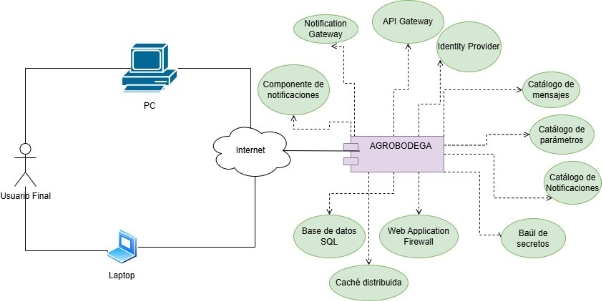
1. # Arquetipo de solución/referencia
Un arquetipo de solución es un patrón arquitectónico de referencia que define la estructura general de la solución de forma agnóstica a las tecnologías específicas. Representa los componentes necesarios y sus relaciones, permitiendo evaluar alternativas antes de comprometerse con un stack concreto.  El arquetipo de referencia adoptado para AGROBODEGA incluye los siguientes componentes agnósticos, tal como se muestra en el diagrama:  1. WAF (Web Application Firewall): Primera línea de defensa perimetral que filtra el tráfico HTTP/HTTPS entre Internet y el Frontend. Justificación: Protege contra SQL Injection, XSS y DDoS sin modificar la lógica del sistema.  2. Frontend AGROBODEGA (storage account): Componente de presentación web alojado en almacenamiento estático. Se comunica mediante HTTPS con el WAF y con el API Gateway. Justificación: Separa la capa de presentación del backend, permitiendo su despliegue y actualización independiente.  3. API Gateway: Punto de entrada centralizado para todos los servicios REST del backend. El Frontend y el Identity Provider se comunican con el backend a través de este componente. Justificación: Centraliza autenticación, enrutamiento, limitación de tasa y observabilidad.  4. Identity Provider: Proveedor centralizado de autenticación. El Frontend lo consulta para autenticar usuarios y obtener tokens que el API Gateway valida. Justificación: Externaliza la autenticación, simplificando la gestión de roles y reduciendo riesgos de seguridad.  5. Backend AGROBODEGA (container management): Núcleo de lógica de negocio desplegado en contenedor. Gestiona inventario, entradas, salidas, cobros, gastos y reportes. Se conecta mediante TCP/IP a la Base de datos y al Caché.  6. Base de datos SQL: Fuente de verdad transaccional con soporte ACID. Conectada al backend mediante TCP/IP. Justificación: Garantiza consistencia entre lotes, entradas, salidas y cobros.  7. Caché: Almacenamiento temporal en memoria para datos de consulta frecuente. Justificación: Reduce la latencia en pantallas de registro sin sobrecargar la base de datos.  8. Notification Gateway: Servicio de envío de notificaciones desacoplado de la lógica de negocio, consumido por el Componente de notificaciones. Justificación: Permite alertas operativas sin impactar la latencia del sistema principal.  9. Componente de notificaciones: Componente interno que genera las alertas del sistema y las despacha hacia el Notification Gateway mediante API.  10. Key Vault: Gestor centralizado de secretos consultado por el backend. Justificación: Ninguna credencial queda expuesta en el código fuente.  11. Catálogo de parámetros: Repositorio centralizado de valores configurables del negocio, consumido por el backend. Justificación: Permite ajustar comisiones y umbrales sin redespliegue.  12. Catálogo de mensajes: Centraliza los textos del sistema mostrados a los usuarios, consumido por el backend. Justificación: Separa el contenido textual de la lógica de negocio.  13. Catálogo de notificaciones: Define y gestiona las plantillas de alertas, consumido por el Componente de notificaciones. Justificación: Permite modificar notificaciones sin tocar el código.  14. CI/CD Pipeline: Flujo automatizado de integración y despliegue continuo conectado al repositorio del Frontend y del Backend. Justificación: Garantiza calidad en cada entrega sin procesos manuales.  [Espacio para insertar el diagrama del arquetipo de referencia]

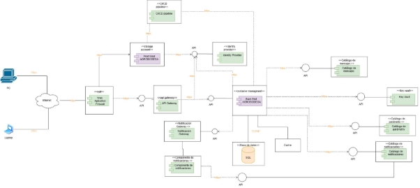
1. # Arquitectura de solución/referencia
La arquitectura de solución es la instancia concreta del arquetipo de referencia, donde cada componente agnóstico se materializa en una tecnología específica seleccionada para AGROBODEGA. La selección considera el presupuesto de $10.000.000 COP, el stack de Spring Boot + PostgreSQL, y la preferencia por soluciones open source o freemium.  Los componentes concretos adoptados, tal como se muestra en el diagrama, son:  1. WAF: Cloudflare WAF (Freemium): Inspecciona y filtra todo el tráfico HTTPS entre Internet y el Frontend. Protege contra SQL Injection, XSS, DDoS y bots maliciosos desde la red global de Cloudflare. Drivers: seguridad, disponibilidad.  2. Frontend AGROBODEGA (static hosting): Interfaz web del sistema alojada en almacenamiento estático. Se comunica con el API Gateway mediante HTTPS para todas las operaciones. Drivers: usabilidad, accesibilidad.  3. API Gateway: Kong Gateway (Open Source / Apache 2.0): Construido sobre NGINX. Enruta solicitudes del Frontend hacia el Backend, valida tokens JWT, aplica limitación de tasa y centraliza observabilidad. Drivers: seguridad, rendimiento, disponibilidad.  4. Identity Provider: Auth0 (Okta) (Freemium - 25.000 MAU): Gestiona autenticación de los tres roles del sistema mediante OAuth 2.0, OpenID Connect y JWT. El Frontend lo consulta para autenticar y obtener tokens. Drivers: seguridad, confiabilidad.  5. Backend AGROBODEGA (container management): Spring Boot  + Spring Security  + Spring Data JPA: Núcleo de lógica de negocio en Java 21 desplegado en contenedor Docker. Gestiona inventario, entradas, salidas, cobros, gastos y reportes. Drivers: confiabilidad, rendimiento.  6. Base de datos: PostgreSQL (Open Source): Motor relacional ACID conectado al backend mediante TCP/IP. Fuente de verdad transaccional del sistema. Drivers: confiabilidad, seguridad.  7. Caché: Redis Community Edition:  (Open Source / RSALv2): Caché en memoria para catálogos de consulta frecuente. Integrado con Spring Data Redis y conectado al backend mediante TCP/IP. Cachea productos base, clasificaciones, cosecheros, negociantes y parámetros de comisión, reduciendo la carga sobre PostgreSQL. Drivers: rendimiento, disponibilidad, capacidad.  8. Notification Gateway: SendGrid (Twilio) API v3 (Freemium — 100 emails/día): Recibe solicitudes del Notification component mediante API y despacha correos electrónicos a los usuarios (alertas de stock insuficiente, permanencia de lotes, confirmaciones, recuperación de contraseña). Drivers: usabilidad, confiabilidad.  9. Notification component: Componente interno del backend: Genera y orquesta las alertas del sistema y las envía al Notification Gateway (SendGrid) mediante API. Consume las plantillas del Catálogo de notificaciones (Strapi). Drivers: usabilidad, disponibilidad.  10. Key Vault → HashiCorp Vault Community (Open Source / BSL): Consultado por el backend mediante HTTPS. Almacena de forma cifrada las credenciales de PostgreSQL, tokens de Auth0 y Kong, y claves de Redis y SendGrid. Permite rotación automática sin redespliegue. Drivers: seguridad, confiabilidad.  11. Catálogo de parámetros → Spring Cloud Config Server (Open Source / Apache 2.0): Consultado por el backend al arrancar. Externaliza valores de comisión por entrada y salida, umbrales de alerta de permanencia de lotes y límites operativos. Redis cachea estos valores para disponibilidad inmediata. Drivers: capacidad para ser administrado, capacidad para ser desplegado.  12. Catálogo de mensajes → Strapi Community 5.x self-hosted (Open Source): Consultado por el backend mediante HTTPS. Centraliza en interfaz visual todos los textos del sistema sin intervención técnica ni redespliegue. Drivers: usabilidad, capacidad para ser administrado.  13. Catálogo de notificaciones → Strapi Community 5.x self-hosted (Open Source): Consultado por el Notification component mediante HTTPS. Define plantillas, destinatarios y configuraciones de todas las alertas del sistema. Drivers: usabilidad, confiabilidad.  14. Observabilidad → OpenTelemetry + Grafana Stack (Open Source / Apache 2.0): El backend instrumentado con OpenTelemetry envía logs estructurados, métricas y trazas al stack de Grafana. Grafana visualiza dashboards en tiempo real, Loki centraliza logs y Tempo gestiona las trazas distribuidas. Toda la suite corre en Docker sin costos adicionales. Drivers: confiabilidad, disponibilidad, capacidad para ser soportado.  15. CI/CD Pipeline → GitHub Actions (Freemium — 2.000 min/mes): Conectado al repositorio GitHub. Automatiza compilación Maven, pruebas unitarias e integración, análisis estático SonarQube, construcción de imágenes Docker y despliegue del frontend (Vercel) y del backend (servidor Linux). Drivers: capacidad para ser desplegado, capacidad para ser probado, capacidad para ser mantenido.  [Espacio para insertar el diagrama de la arquitectura de solución]

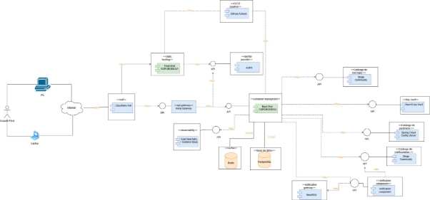
1. # Línea base arquitectónica
La línea base arquitectónica es el conjunto de decisiones de diseño definitivas que establecen el punto de partida estable del sistema. Define los componentes adoptados, sus versiones, sus relaciones y las restricciones que no pueden modificarse sin pasar por un proceso de control de cambios. Para AGROBODEGA, la línea base documenta todos los componentes de la plataforma tecnológica seleccionados junto con su justificación técnica y motivación arquitectónica.
1. ## Línea base arquitectónica de componentes
La línea base arquitectónica de componentes de AGROBODEGA está conformada por dos componentes a desarrollar y trece componentes adoptados. Todos tienen licenciamiento open source, freemium o de costo cero dentro del volumen esperado de la bodega agrícola. A continuación se describe cada componente con su intención, motivación, dependencias y tipo.
1. ## Componente 1
agrobodega-backend — v1.0.0-SNAPSHOT Tipo: Componente a desarrollar  Descripción: Aplicación principal Spring Boot que implementa arquitectura hexagonal con capas domain, application, infrastructure y crosscutting. Gestiona los módulos de inventario, entradas, salidas, cobros, gastos, usuarios, cosecheros, negociantes, productos base, clasificaciones y reportes de rentabilidad. Expone una API REST documentada con Springdoc OpenAPI y protegida mediante Spring Security con tokens JWT emitidos por Auth0.  Motivación: Centraliza toda la lógica de negocio de la bodega agrícola. La arquitectura hexagonal garantiza que las reglas de negocio (cálculo de comisiones, validación de stock, creación de lotes) no dependan de tecnologías externas, permitiendo evolucionar los adaptadores de persistencia, caché o notificaciones sin modificar el dominio. Contribuye directamente a los drivers de confiabilidad, capacidad para ser mantenido y capacidad para ser probado.  Depende / Usa: Spring Boot 3.x | Spring Web 3.x | Spring Data JPA 3.x | Spring Security 6.x | Spring Cloud Config | PostgreSQL JDBC Driver | Spring Data Redis | Java 21 | Auth0 (JWT) | Springdoc OpenAPI
1. ## Componente 1
Redis Community Edition 7.x — Cache de Datos Fabricante: Redis Ltd | Licencia: Open Source (RSALv2/SSPL) Justificación: Almacena en memoria catálogos frecuentes: productos base, clasificaciones, cosecheros, negociantes y parámetros de comisión. Integrado con Spring Data Redis. Motivación: Reducir latencia en pantallas de registro, garantizando respuesta en menos de 3 segundos bajo carga simultánea. Drivers: rendimiento, disponibilidad, capacidad.  PostgreSQL 16.x — Databases Fabricante: PostgreSQL Global Development Group | Licencia: Open Source Justificación: Motor relacional ACID. Almacena usuarios, productos, clasificaciones, cosecheros, negociantes, lotes, entradas, salidas, cobros, gastos, inventario y alertas. Integridad referencial garantiza consistencia entre entidades. Spring Data JPA + Hibernate proveen integración nativa. Motivación: Fuente de verdad del sistema. Contribuye a confiabilidad, seguridad, capacidad y capacidad para ser administrado.  SendGrid API v3 — Notification Gateway Fabricante: Twilio Inc. | Licencia: Freemium (100 emails/día gratis) Justificación: Envía alertas de stock insuficiente, permanencia prolongada de lotes, confirmaciones y recuperación de contraseña mediante API REST. SDK oficial para Java. Motivación: Desacoplar notificaciones de la lógica de negocio. Drivers: usabilidad, disponibilidad, confiabilidad.  Spring Cloud Config Server — Parameters Catalog Fabricante: VMware/Broadcom (Spring) | Licencia: Open Source (Apache 2.0) Justificación: Externaliza valores de comisión, umbrales de alerta y configuraciones operativas. Los servicios obtienen parámetros dinámicamente al arrancar. Redis los cachea. Motivación: Ajustar reglas de negocio sin redespliegue. Drivers: capacidad para ser administrado, soportado y desplegado.  Strapi Community 5.x self-hosted — Message Catalog Fabricante: Strapi Solutions SAS | Licencia: Open Source Justificación: Centraliza todos los textos del sistema (mensajes de error, confirmaciones, alertas) en interfaz visual sin intervención técnica. Motivación: Separar contenido textual de la lógica de negocio. Drivers: usabilidad, capacidad para ser administrado.  Strapi Community 5.x self-hosted — Notification Catalog Fabricante: Strapi Solutions SAS | Licencia: Open Source Justificación: Centraliza plantillas y configuraciones de todas las notificaciones. Plantillas consumidas por SendGrid al enviar alertas. Motivación: Desacoplar la definición de notificaciones del backend. Drivers: usabilidad, confiabilidad.  OpenTelemetry + Grafana Stack (Grafana + Loki + Tempo) — Instrumentation and Monitoring Fabricante: OpenTelemetry / Grafana Labs | Licencia: Open Source (Apache 2.0) Justificación: OpenTelemetry instrumenta el backend para capturar logs, métricas y trazas. Grafana visualiza dashboards, Loki centraliza logs, Tempo gestiona trazas. Toda la suite corre en Docker sin costos. Motivación: Observabilidad completa en producción. Drivers: confiabilidad, disponibilidad, capacidad para ser soportado.  GitHub Actions — CI/CD Pipeline Fabricante: Microsoft Corporation | Licencia: Freemium (2.000 min/mes gratis) Justificación: Automatiza compilación Maven, pruebas unitarias e integración, análisis SonarQube, construcción imagen Docker y despliegue. Integrado nativamente con el repositorio GitHub. Motivación: Garantizar calidad en cada entrega sin procesos manuales. Drivers: capacidad para ser desplegado, probado y mantenido.  Docker Engine + Docker Compose — Containers Fabricante: Docker, Inc. | Licencia: Open Source (Apache 2.0) / Docker Desktop Freemium Justificación: Empaqueta todos los servicios (Spring Boot, PostgreSQL, Redis, Vault, Config Server, Strapi x2, Grafana Stack) en contenedores aislados. Docker Compose orquesta arranque y red interna. Motivación: Despliegue consistente, reproducible y portable. Drivers: capacidad para ser desplegado, soportado y mantenido.  Springdoc OpenAPI / Swagger UI 2.x — Documentación de API Fabricante: SmartBear Software | Licencia: Open Source (Apache 2.0) Justificación: Genera automáticamente especificación OpenAPI 3.0 de todos los endpoints desde anotaciones del código Spring Boot. Swagger UI permite probar endpoints desde el navegador. Motivación: Documentación siempre sincronizada con la implementación. Drivers: capacidad para ser probado, usabilidad.  Spring Security + Auth0 RBAC — Autorización de APIs Fabricante: Auth0 (Okta) / Spring Security | Versión: Spring Security 6.x | Licencia: Open Source (Apache 2.0) Justificación: Spring Security valida el token JWT emitido por Auth0 en cada solicitud, extrayendo el rol del usuario antes de permitir la operación. Garantiza que el administrador de bodega no acceda a reportes de rentabilidad exclusivos del propietario. Motivación: Control de acceso por rol en cada endpoint. Drivers: seguridad, confiabilidad, capacidad para ser administrado.
1. ## Estilos y patrones arquitectónicos adoptados
Los estilos y patrones arquitectónicos son soluciones probadas y reutilizables que responden a problemas recurrentes en el diseño de sistemas de software. En AGROBODEGA, los estilos adoptados determinan cómo se organizan los módulos del backend y frontend, cómo se comunican los componentes y cómo se garantiza la separación de responsabilidades, alineándose con las restricciones técnicas de Clean Code, SOLID y los 12 factores de aplicación.
1. ## Estilo arquitectónico 1
La arquitectura hexagonal organiza el sistema en tres zonas concéntricas: el dominio (núcleo de negocio sin dependencias externas), la aplicación (casos de uso y puertos que definen contratos) y la infraestructura (adaptadores que implementan los contratos conectando con tecnologías externas como PostgreSQL, Redis, Auth0 o SendGrid).
1. ##  Nombre
Arquitectura Hexagonal 
1. ##  Problema
En AGROBODEGA, la lógica de negocio (cálculo de comisiones, validación de stock, creación de lotes) no debe depender de frameworks, bases de datos ni servicios externos. Si el dominio conoce directamente a PostgreSQL o Redis, cualquier cambio en la infraestructura obliga a modificar las reglas de negocio, dificultando las pruebas y aumentando el riesgo de errores en módulos críticos.
1. ##  Solución/Motivación
El backend de AGROBODEGA adopta arquitectura hexagonal con los siguientes paquetes: domain (entidades: Producto, Clasificacion, Lote, Entrada, Salida, Cosechero, Negociante, Cobro, Gasto, Usuario), application (puertos de entrada inputport, puertos de salida outputport, casos de uso usecase y sus validadores), features (implementaciones por funcionalidad: registrarEntrada, registrarSalida, consultarInventario, etc.), infrastructure (adaptadores: entrypoint REST, persistencia JPA con PostgreSQL, caché Redis, notificaciones SendGrid) y crosscutting (excepciones, helpers, catálogo de mensajes, especificaciones). Esta estructura garantiza que el dominio nunca dependa de la infraestructura, facilitando pruebas unitarias del núcleo de negocio sin levantar bases de datos.
1. ## Estilo arquitectónico 2
API REST (Representational State Transfer): Estilo arquitectónico para la comunicación entre el frontend y el backend mediante HTTP, usando recursos identificados por URLs y operaciones estándar (GET, POST, PUT, DELETE).
1. ##  Nombre
API REST
1. ##  Problema
AGROBODEGA requiere que el frontend web pueda comunicarse con el backend de Spring Boot de forma estándar, sin acoplamiento a una tecnología específica de presentación, y que el API Gateway pueda interceptar, autenticar y enrutar cada solicitud.
1. ##  Solución/Motivación
El backend expone todos sus módulos (usuarios, productos, entradas, salidas, inventario, reportes) como endpoints REST con respuestas en JSON, documentados automáticamente con OpenAPI 3.0 (Springdoc). Esto permite que el frontend, el API Gateway y futuras integraciones consuman los servicios de forma uniforme y predecible.
## 7.2.N Estilo arquitectónico 2
La seguridad centralizada con RBAC es un enfoque arquitectónico donde los mecanismos de autenticación y autorización son gestionados por un componente especializado externo al sistema principal, con control de acceso diferenciado por rol de usuario.
## 7.2.N.1 Nombre
Seguridad centralizada con RBAC (Role-Based Access Control)
## 7.2.N.2 Problema
En AGROBODEGA existen tres roles con accesos diferenciados: el administrador de bodega no puede ver reportes de rentabilidad, el propietario tiene acceso total, y el administrador del sistema gestiona usuarios sin acceder a movimientos operativos. Sin RBAC, cualquier usuario autenticado podría acceder a cualquier funcionalidad.
## 7.2.N.3 Solución/Motivación
Spring Security intercepta cada solicitud al backend, valida el token JWT emitido por Auth0 y verifica que el rol del usuario tenga permiso para ejecutar la operación solicitada. Las reglas de autorización se definen mediante anotaciones @PreAuthorize directamente en los controladores REST, garantizando que cada endpoint sea accesible únicamente por los roles correspondientes.  Estilo arquitectónico 4 — SPA (Single Page Application) Nombre: SPA con React + TypeScript Problema: El frontend de AGROBODEGA requiere una interfaz fluida para el registro de entradas y salidas sin recargar la página en cada operación, ya que los administradores realizan múltiples registros consecutivos durante la jornada. Solución/Motivación: El frontend se implementa como SPA con React 18 + TypeScript y React Router DOM para la navegación entre módulos sin recarga de página. Vite provee el servidor de desarrollo y el build optimizado para producción. Tailwind CSS garantiza consistencia visual y diseño responsivo sin escribir CSS personalizado.  Estilo arquitectónico 5 — Observabilidad centralizada Nombre: Observabilidad centralizada con OpenTelemetry + Grafana Stack Problema: Los errores y problemas de rendimiento en producción son difíciles de detectar sin instrumentación adecuada, especialmente en operaciones críticas como el registro de entradas y salidas. Solución/Motivación: OpenTelemetry instrumenta el backend Spring Boot para capturar logs estructurados, métricas y trazas distribuidas. Grafana visualiza dashboards en tiempo real, Loki centraliza logs y Tempo gestiona trazas. Toda la suite corre en Docker sin costos adicionales.  Estilo arquitectónico 6 — Configuración externalizada Nombre: Configuración externalizada con Spring Cloud Config Problema: Los cambios en los valores de comisión por entrada/salida o en los umbrales de alerta de inventario requieren modificar el código fuente y hacer redespliegue, generando riesgos innecesarios. Solución/Motivación: Los parámetros, mensajes y configuraciones del sistema se administran desde Spring Cloud Config Server y los catálogos Strapi (mensajes y notificaciones), permitiendo ajustar el comportamiento del sistema sin tocar el código.  Estilo arquitectónico 7 — Gestión externalizada de secretos Nombre: Gestión externalizada de secretos con HashiCorp Vault Problema: Guardar credenciales de base de datos, tokens de servicios externos o claves de API dentro del código fuente o archivos de configuración representa un riesgo grave de seguridad. Solución/Motivación: Todas las credenciales y secretos sensibles de AGROBODEGA se almacenan en HashiCorp Vault Community, accesible en tiempo de ejecución por el backend. Esto garantiza rotación segura de credenciales sin redespliegue y evita exposición en el repositorio.
1. # Justificación alternativa de solución
La justificación de la alternativa de solución documenta por qué la arquitectura seleccionada para AGROBODEGA es la más adecuada frente a otras opciones posibles, considerando las restricciones del proyecto y los drivers arquitectónicos priorizados.
1. ## Justificación
La alternativa seleccionada para AGROBODEGA combina Spring Boot + PostgreSQL + Docker en el backend, Auth0 para identidad, Kong Gateway como punto de entrada, Redis para caché, y un conjunto de servicios complementarios open source o freemium. Esta combinación es la más adecuada por las siguientes razones: (1) Alineación con las restricciones técnicas: Spring Boot es el framework exigido, PostgreSQL es la base de datos requerida, y las prácticas DevOps se satisfacen con GitHub Actions y Docker. (2) Costo cero o mínimo: todos los componentes tienen licencia open source o plan gratuito suficiente para el volumen de la bodega agrícola. (3) Cobertura de los atributos de calidad prioritarios: las transacciones ACID de PostgreSQL cubren confiabilidad, Docker garantiza disponibilidad, Spring Security + Auth0 cubren seguridad, y Redis cubre rendimiento. (4) Viabilidad para el equipo: el stack es familiar para el equipo académico y cuenta con abundante documentación y comunidad.
1. ## Ventajas
1\. Costo total prácticamente cero para el volumen de operación esperado: todos los componentes son open source o tienen planes freemium que cubren las necesidades del proyecto. 2. Stack tecnológico alineado con las restricciones técnicas definidas: Spring Boot, PostgreSQL y prácticas DevOps ya eran requisitos del proyecto. 3. Robustez transaccional de PostgreSQL garantiza integridad del inventario ante fallos concurrentes. 4. Auth0 elimina la necesidad de implementar y mantener un sistema de autenticación propio, reduciendo riesgos de seguridad. 5. Docker Compose permite levantar todo el entorno con un único comando, facilitando onboarding y despliegue. 6. GitHub Actions integrado nativamente con el repositorio elimina configuración de infraestructura CI/CD adicional. 7. Todos los componentes tienen amplia documentación, comunidad activa y compatibilidad probada con Spring Boot.
1. ## Desventajas
1\. Curva de aprendizaje: la integración de múltiples componentes (Auth0, Kong, Vault, Redis, OpenTelemetry) requiere tiempo de configuración que puede presionar el cronograma del equipo. 2. Dependencia de servicios externos: Auth0 y SendGrid son servicios SaaS con disponibilidad dependiente de terceros. 3. Complejidad operativa: orquestar 10+ servicios con Docker Compose puede ser desafiante en un entorno de producción sin experiencia previa en DevOps. 4. Límites del plan gratuito: Auth0 (25.000 MAU) y SendGrid (100 emails/día) tienen restricciones que podrían requerir migración a planes pagos si el negocio crece significativamente. 5. HashiCorp Vault requiere configuración inicial no trivial para el almacenamiento seguro de secretos en producción.
1. # Vistas de arquitectura del sistema
   1. ## Visión 

1. ## Mapa de impacto

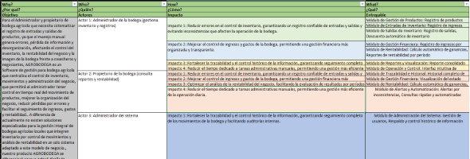
1. ## Diagrama de componentes
Un diagrama de componentes es una representación gráfica que muestra los artefactos, bibliotecas y dependencias que conforman un sistema de software, así como las relaciones entre ellos. Su objetivo es describir la estructura física y lógica de los componentes desplegables del sistema, identificando cómo se organizan internamente y a través de qué interfaces interactúan. En AGROBODEGA este diagrama permite comprender las dependencias tecnológicas de cada artefacto, validar la coherencia entre la arquitectura definida y la implementación real, y servir como referencia técnica durante el ciclo de vida del proyecto.
1. ## Backend AGROBODEGA
El Backend de AGROBODEGA es el núcleo de lógica de negocio del sistema. Su motivación es centralizar el procesamiento de todas las operaciones críticas: registro de entradas y salidas de inventario, gestión de lotes, cobros por comisión, gastos operativos y generación de reportes de rentabilidad. Está implementado como una aplicación Spring Boot ejecutada sobre Java 26, que expone una API REST consumida por el Frontend a través del Kong Gateway y aplica control de acceso mediante Spring Security con tokens JWT emitidos por Auth0.
1. ## Diagrama

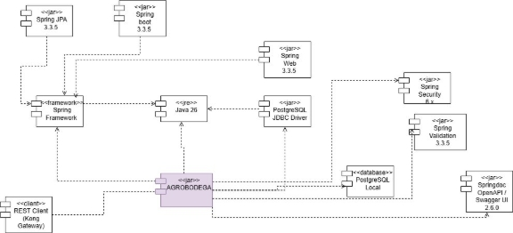
1. ## Documentación
El diagrama muestra el componente principal AGROBODEGA («jar») como artefacto central, ejecutado sobre el runtime Java 26 («jre»). Integra las siguientes dependencias: Spring Boot 3.3.5 (contenedor de aplicación y autoconfiguración); Spring JPA 3.3.5 (persistencia mediante Hibernate + PostgreSQL JDBC Driver); Spring Web 3.3.5 (endpoints REST y procesamiento HTTP); Spring Security 6.x (validación de token JWT y reglas RBAC); Spring Validation 3.3.5 (validación de datos de entrada); PostgreSQL Local — base de datos relacional ACID fuente de verdad del sistema; Springdoc OpenAPI / Swagger UI 2.6.0 (generación automática de documentación OpenAPI 3.0); REST Client Kong Gateway — punto de entrada único que consume la API REST del backend; Spring Framework — base común del ecosistema Spring.
1. ## Frontend AGROBODEGA
El Frontend de AGROBODEGA es la interfaz web con la que interactúan el administrador de bodega y el propietario. Su motivación es ofrecer una experiencia ágil para el registro de entradas, salidas, consulta de inventario y visualización de reportes desde cualquier navegador. Está implementado como SPA (Single Page Application) con React 18 + TypeScript, construida con Vite y estilizada con Tailwind CSS. Se comunica exclusivamente con el Backend a través del Kong Gateway mediante HTTPS.
1. ## Diagrama

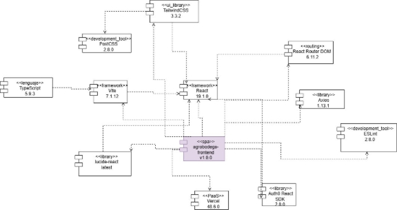
1. ## Documentación
El diagrama muestra el componente principal agrobodega-frontend v1.0.0 («spa») como artefacto central, junto con todas sus dependencias tecnológicas: TypeScript 5.9.3 («lenguaje») — lenguaje de programación con tipado estático; Vite 7.1.12 («framework») — herramienta de build y servidor de desarrollo con recarga instantánea; PostCSS 2.8.0 («development\_tool») — procesador CSS que optimiza los estilos en el build; TailwindCSS 3.3.2 («ui\_library») — framework de utilidades CSS para interfaz responsiva; React 19.1.0 («framework») — biblioteca principal para construcción de la SPA; React Router DOM 6.11.2 («outing») — navegación entre páginas y guards de autenticación; Axios 1.13.1 («library») — cliente HTTP para llamadas a la API REST del Backend; Auth0 React SDK 2.8.0 («library») — autenticación, tokens JWT y sesión del usuario; lucide-react latest («library») — iconos vectoriales reutilizables en la interfaz; ESLint 2.8.0 («development\_tool») — análisis estático para calidad del código TypeScript; Vercel 48.6.0 («PaaS») — plataforma de hosting estático para el despliegue en producción.
1. ## Diagrama de paquetes
Un diagrama de paquetes es una representación gráfica que organiza los módulos o componentes del sistema en grupos lógicos según sus responsabilidades y dependencias. Su objetivo es mostrar cómo se estructura internamente el código fuente, facilitando la separación de responsabilidades y la comprensión de la arquitectura. En AGROBODEGA permite visualizar la organización de capas del Backend y la estructura modular del Frontend, sirviendo como guía para el desarrollo y el mantenimiento del sistema.
1. ## Diagrama de paquetes Backend AGROBODEGA
El paquete Backend de AGROBODEGA organiza el código fuente de la aplicación Spring Boot siguiendo una arquitectura en capas bajo el namespace raíz com.agrobodega. Su motivación es separar claramente las responsabilidades de cada capa — dominio, aplicación, infraestructura y configuración — para reducir el acoplamiento, facilitar las pruebas unitarias y mejorar la mantenibilidad del código a lo largo del ciclo de vida del proyecto.
1. ## Diagrama

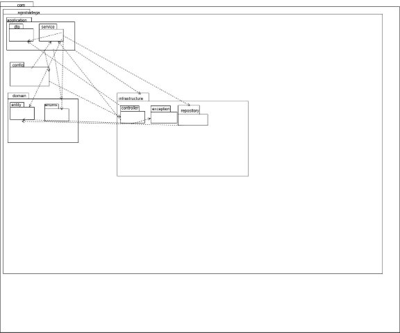

1. ## Documentación
El diagrama muestra la estructura de paquetes del backend bajo la raíz com.agrobodega, organizada en cuatro capas principales: application — contiene dto (objetos de transferencia de datos de entrada y salida) y service (servicios de lógica de negocio: UserService, ProductService, InventoryService, ThirdPartyService, ExpenseService, ReportService, AlertService). Esta capa coordina los casos de uso y depende de domain e infrastructure.repository; config — configuración de Spring Security, CORS y beans transversales de la aplicación. Depende de application.service e infrastructure.controller; domain — núcleo del negocio, contiene entity (entidades JPA: Lot, EntryMovement, ExitMovement, ProductBase, Farmer, Trader, Alert, Parameter, entre otras) y enums (enumeraciones del dominio: Role, ChargeType, AlertType, AlertStatus). No depende de ninguna otra capa; infrastructure — implementaciones técnicas, contiene controller (controladores REST que exponen la API), exception (GlobalExceptionHandler y excepciones personalizadas) y repository (repositorios Spring Data JPA para acceso a PostgreSQL). Depende de application y domain.
1. ## Diagrama de paquetes Frontend AGROBODEGA
El paquete Frontend de AGROBODEGA organiza el código fuente de la SPA React bajo la raíz agrobodega. Su motivación es separar las responsabilidades de configuración, presentación, navegación y comunicación con el Backend en módulos independientes, facilitando la escalabilidad de la interfaz y el mantenimiento independiente de cada funcionalidad del sistema.
1. ## Diagrama

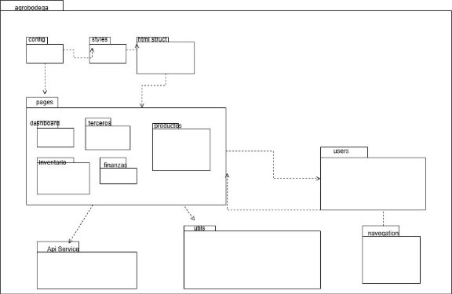

1. ## Documentación
El diagrama muestra la estructura de paquetes del Frontend bajo la raíz agrobodega, organizada en los siguientes módulos: config — variables de entorno, configuración base de Axios y constantes globales de la aplicación. Referenciado por pages como dependencia de configuración; styles — estilos globales, configuración de Tailwind CSS y variables CSS compartidas. Utilizado por html struct para aplicar la capa visual; html struct — estructura HTML raíz de la SPA y punto de montaje de React. Depende de styles y recibe el árbol de componentes de pages; pages — módulo central que agrupa las páginas del sistema según el dominio: dashboard (indicadores y resumen operativo), terceros (cosecheros y negociantes), productos (productos base y clasificaciones), inventario (consulta de lotes) y finanzas (cobros, gastos y rentabilidad). Cada página consume Api Service; Api Service — capa de servicios HTTP con Axios que encapsula todas las llamadas al Backend a través del Kong Gateway. Un servicio por módulo funcional; utils — funciones utilitarias reutilizables entre módulos: formateo de fechas, cálculos numéricos y validaciones de formulario; navegation — configuración de React Router DOM con las rutas de la aplicación y los guards de autenticación que protegen las rutas privadas; users — gestión del flujo de autenticación con Auth0, manejo del token JWT y estado global del usuario autenticado.
1. ## Diagrama de secuencia
Un diagrama de secuencia es una representación gráfica que muestra el intercambio de mensajes entre los componentes de un sistema a lo largo del tiempo para ejecutar una funcionalidad específica. Su objetivo es visualizar el flujo de ejecución, el orden de las operaciones y las responsabilidades de cada componente durante un proceso. En AGROBODEGA este diagrama permite comprender cómo interactúan el Frontend y el Backend en la ejecución de un caso de uso, facilitando la detección de dependencias y la validación de la arquitectura en capas definida.
1. ## Backend AGROBODEGA
El diagrama de secuencia del Backend muestra el flujo de ejecución interno de la aplicación Spring Boot para cualquier caso de uso del sistema. Su motivación es evidenciar cómo las capas de la arquitectura (Controller, Interactor, UseCaseImpl, Persistence y External Service) interactúan de forma ordenada y desacoplada, validando que la lógica de negocio permanece separada de los detalles técnicos de infraestructura.
1. ## Diagrama

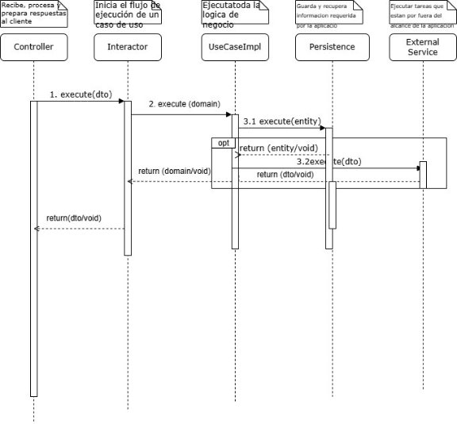

1. ## Documentación
El diagrama muestra el flujo de ejecución del Backend a través de cinco participantes: Controller — recibe la petición HTTP, valida el token JWT y delega con execute(dto) al Interactor; Interactor — inicia el caso de uso, transforma el DTO a dominio y llama execute(domain) a UseCaseImpl; UseCaseImpl — ejecuta la lógica de negocio. En el paso 3.1 llama execute(entity) a Persistence para operaciones de base de datos. En el paso 3.2 llama execute(dto) a External Service si el caso de uso lo requiere (bloque opt); Persistence — ejecuta las operaciones JPA sobre PostgreSQL y retorna entity/void; External Service — servicio externo opcional (Auth0, HashiCorp Vault, Spring Cloud Config). La respuesta sube en cascada: UseCaseImpl retorna domain/void al Interactor, Interactor retorna dto/void al Controller, y Controller retorna dto/void al cliente.
1. ## Frontend AGROBODEGA
El diagrama de secuencia del Frontend muestra el flujo completo de una interacción del usuario con la SPA de AGROBODEGA, desde el evento inicial hasta la actualización de la interfaz. Su motivación es evidenciar cómo los componentes React, los servicios HTTP y el Backend API REST colaboran para registrar operaciones de inventario, terceros, finanzas o productos de forma ordenada y con retroalimentación visual al usuario.
1. ## Diagrama

1. ## Documentación
El diagrama muestra el flujo de una operación típica a través de cinco participantes: Usuario — genera el evento inicial haciendo clic en la interfaz (1. click); Página — recibe el evento, captura los datos y llama submit(dto) al Componente React (2); Componente React — ejecuta validarCampos(dto) como auto-llamada interna (3). Si los datos son válidos (4. válido), llama registrar(dto) al Service (5); Service — ejecuta POST /api contra el Backend API REST vía Kong Gateway (6), recibe el Response (7) y retorna la Respuesta al Componente React (8); Backend API REST — procesa la solicitud y retorna el resultado (7. Response). Finalmente el Componente React actualiza la UI de la Página (9. Actualizar UI) y ésta muestra el Mensaje de confirmación al Usuario (10).
1. ## Componente N
<Defina en términos comprensibles cuál es la motivación de este componente.>
1. ## Diagrama

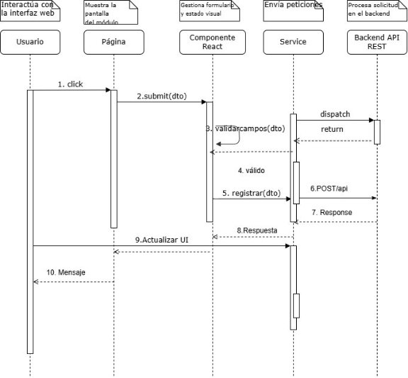

1. ## Modelo de capas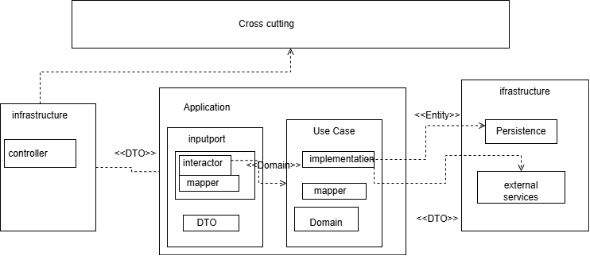
1. ## Diagrama de despliegue
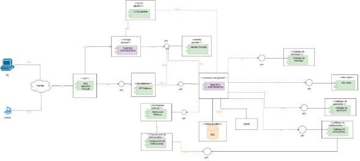

